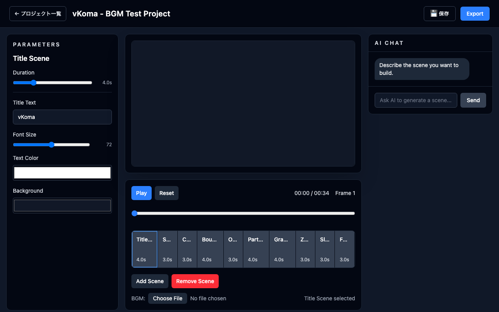
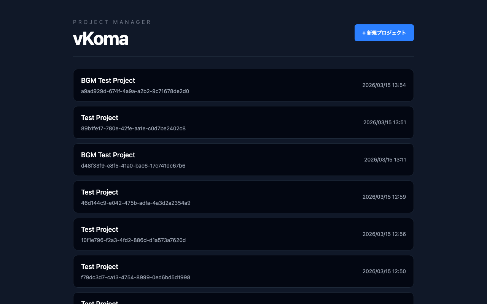

# vKoma 🎬

> AI-powered video creation through chat — describe scenes, tweak parameters, export MP4



**vKoma** lets you create videos by chatting with AI. Describe what you want, and AI generates animated scenes with adjustable parameters — sliders, color pickers, and dropdowns let you fine-tune everything without touching code.

## Features

- 🤖 **AI-powered scene generation** — describe a scene in natural language, Claude generates the code via SSE streaming
- 🎛️ **Parameter panel** — sliders, color pickers, and selects auto-generated from scene schema
- 🎬 **Built-in scene presets** — title, particles, gradient, bounce, orbit, zoom-in, slide, and more
- 🎵 **BGM mixing** — attach background music, mixed into the final export via ffmpeg
- 📁 **Project save/load** — persist and resume your work
- 🎥 **MP4 export** — frame-by-frame capture with Playwright + ffmpeg encoding
- ✅ **E2E tested** — Playwright test suite included

## Quick Start

```bash
git clone https://github.com/kojira/vkoma
cd vkoma
pnpm install

# Start dev servers
pnpm --filter server dev &
pnpm --filter ui dev

# Open http://localhost:5174
```

## Requirements

- Node.js 18+
- pnpm
- ffmpeg
- Claude CLI (for AI scene generation)

## Usage

1. Click **"+ 新規プロジェクト"** to create a new project
2. Type a scene description in the AI chat panel (e.g., "Create a title scene with blue gradient background")
3. AI generates scenes → timeline updates automatically
4. Fine-tune parameters with sliders and color pickers
5. Click **Export** → MP4 is rendered and downloaded



## Tech Stack

| Layer | Technology |
|-------|-----------|
| UI | React + TypeScript + Tailwind CSS + Zustand |
| Server | Node.js + Hono |
| Video | Playwright (frame capture) + ffmpeg |
| AI | Claude CLI (SSE streaming) |
| Testing | Playwright E2E |

## Project Structure

```
packages/
  ui/       — React frontend (Vite)
  server/   — Hono API server
  core/     — Shared types and scene definitions
```

## カスタマイズ

### プロジェクト保存先ディレクトリの変更

デフォルトでは `~/vkoma-projects` にプロジェクトが保存されます。
`VKOMA_PROJECTS_DIR` 環境変数を設定することで、任意のディレクトリに変更できます。

```bash
# 外付けドライブに変更する例
export VKOMA_PROJECTS_DIR=/Volumes/2TB/vkoma-projects

# または packages/server/.env.example を .env にコピーして設定
cp packages/server/.env.example packages/server/.env
# .env を編集して VKOMA_PROJECTS_DIR= の値を設定
```

`packages/server/.env.example` に設定例があります。

## License

MIT
